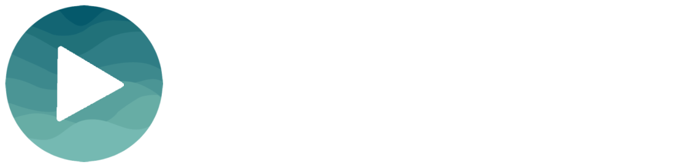
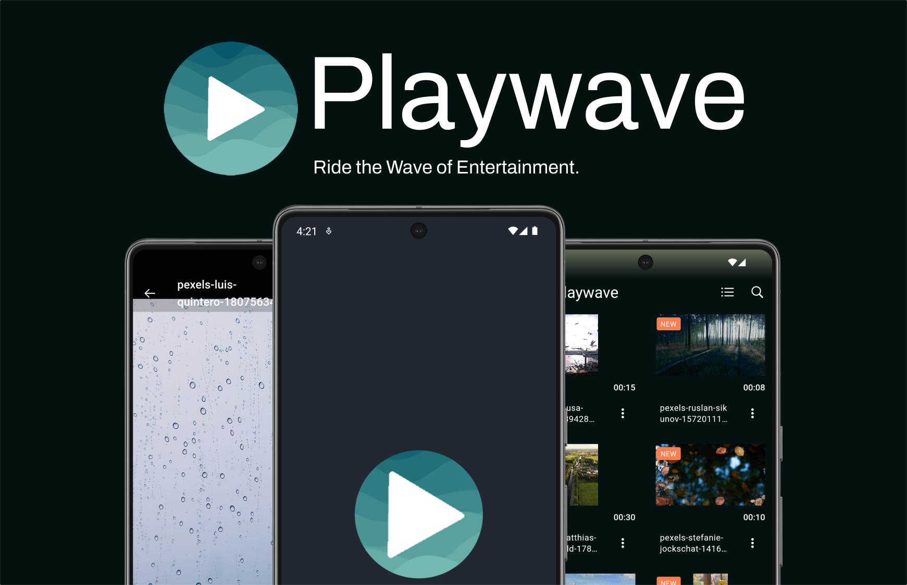
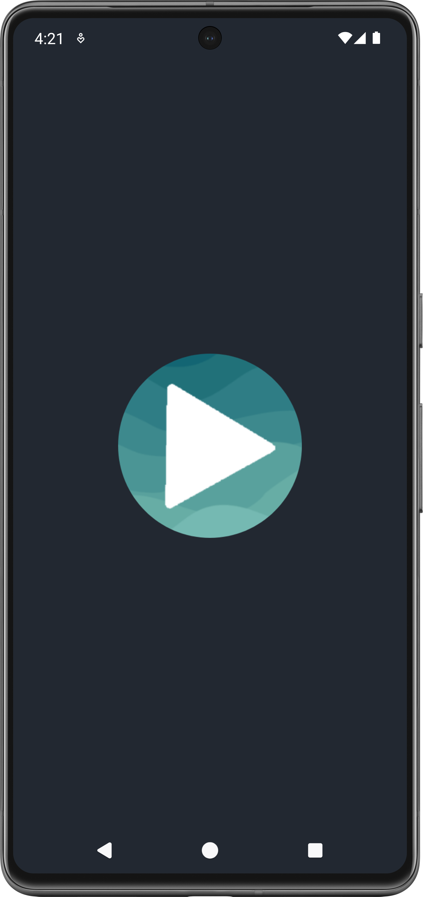
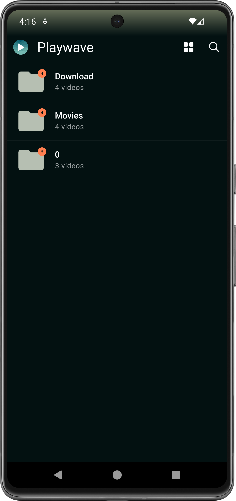
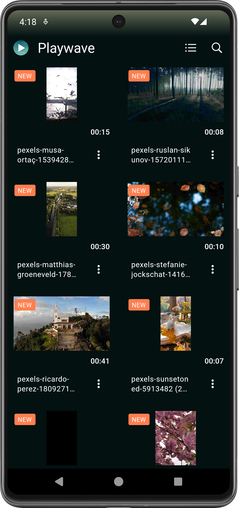
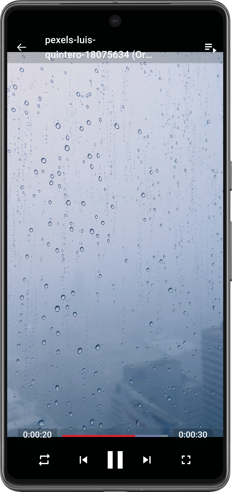

# PlayWave

PlayWave is a dynamic video player app built with Flutter, showcasing seamless orientation transitions, video thumbnail previews, and intuitive folder management.


## Features

- **Video Thumbnail Previews:** 
  - Quickly identify and select videos with generated thumbnail previews.
- **Orientation Transitions:** 
  - Enjoy a seamless transition between portrait and landscape orientations while browsing or watching videos.
- **Intuitive Folder Management:** 
  - Organize your videos in folders for easy access and management.
- **Hive Database:** 
  - Leveraging Hive for efficient and performant data storage and retrieval.
- **Customizable Views:** 
  - Toggle between grid and list views to suit your browsing preference.
- **...and more!**


## Getting Started

### Prerequisites

- Flutter SDK (https://flutter.dev/docs/get-started/install)
- Android Studio or Xcode

1. **Clone the repository:**

   ```bash
   git clone https://github.com/your_username/PlayWave.git
   ```
2. **Navigate to the project directory:**

```bash
cd PlayWave
```
3. **Install dependencies:**

```bash
flutter pub get
```
4. **Run the app:**

```bash
flutter run
```
## Usage

Playwave is designed to be user-friendly and easy to navigate. Here's a basic rundown on how to use the app:

1. **Installation:**
    - Clone the GitHub repository to your machine.
    - Navigate to the project directory.
    - Run `flutter pub get` to install dependencies.
    - Run `flutter run` to start the app.

2. **Home Screen:**
    - The home screen displays a list/grid of video folders.
    - Tap on any folder to view its contents.
    - Use the sort and filter options to customize the view.

3. **Video Playback:**
    - Tap on any video to start playback.
    - Use the playback controls to play/pause, seek, or adjust volume.

4. **Search:**
    - Use the search bar to quickly find videos or folders.
    - Results update in real-time as you type.

5. **Settings:**
    - Access settings to customize your experience.
    - Adjust playback preferences, theme settings, and more.

6. **File Management:**
    - Long press to select videos or folders.
    - Use the options menu to delete or move items.

For more detailed instructions, check out the [Wiki](https://github.com/ThanAngus/Playwave/wiki).


## Screenshots

Here are some screenshots of the app:







## Tech Stack

- **Flutter** - UI framework
- **Hive** - Local database solution
- **Dart** - Programming language


## License

This project is licensed under the MIT License - see the [LICENSE.md](LICENSE.md) file for details.